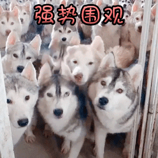

# 页面追踪用户最新操作

事情的起因是这样的：一行开发坐在一起抠脚，坐等项目上线。


对面的测试老师，偶尔点点页面。忽然，测试老师发声了：“这里有个bug……”

话音刚落，一众开发炸了锅，一个个怒不可遏地围了上来。我们的代码完美无瑕，怎么可能有bug？肯定是你们打开的方式不对。


测试也不甘示弱，招手示意我们过去。开发仗着人多势众，气势汹汹地为了上去。谁怕谁，看你能玩儿出什么花儿来。我们的代码铜墙铁壁，无懈可击，360度无死角。



只见测试食指轻触鼠标左键，手腕灵活而又不失节奏地疯狂摆动。鼠标不停地切换着“内容一”和“内容二”，浏览器疯狂地发送着请求。

突然测试停下了，大家不由屏住呼吸，看着页面数据自己在跳动着。仿佛是在等待大转盘最后地结果，小球停留地位置的对错，这也将是最终的宣判。最后结果出来了，页面数据显示是“内容一”，标签显示的是——“内容一”。

开发一声欢呼，纷纷举起了手中“40米的大刀”，神挡杀神，佛挡杀佛。


就在这千钧一发时刻，测试一声惊喝：且慢，容我复测一下！

他思考了一下，开启了弱网模式，重复以上操作……结果却出乎意料，页面变成了“薛定谔”的页面。看到这番风骚地操作，开发都惊掉了下巴，一开始的气势一泻千里。


大家都陷入了沉默。这确实是一个问题，页面响应与用户操作不同，这个是万万不行滴。就像大家去吃饭，点了黄焖鸡，但是上来了一碗蛋炒饭一样，恐怕这样的饭店是开不下去的。

针对这种情况，大家展开了讨论。开发分裂为前端和后台，双方展开了激烈的责任“争夺（推卸）战”。

前端：这个得后台返回状态码，否则无法区分。

后台：（懵逼状态中……）呸！

前端：前端自己无法控制请求，我们也无能为力。

后台：（懵逼状态中……）呸！

前端：不然你说我们怎么做？（得意洋洋）

谢同学（后台代表之一）：吾有一言，请诸位静听！王司徒……


拿错剧本了！！！

谢同学：闭包可解。

前端：（懵逼状态中……）呸！

谢同学：闭包中定义一个请求状态码，并在全局中定义一个变量，保存当前请求状态码。每次发请求，全局码必然是最新状态码，而闭包中的状态码则是请求自己的状态码，并且请求不结束不会被清理。当请求返回之后，比较全局码和请求码是否相等；若相等，则为最新请求，执行渲染操作；若不等，说明请求已过期，舍弃掉……代码如下

```javascript
// 定义全局变量
let latestReq = null;

function request() {
    // 定义当前请求码
    let currentReq = '001';
    // 同步请求码到全局
    latestReq = currentReq
    // 发送请求
    this.$http.get(url).then(req => {
        // 是当前请求，进行操作
        if (latestReq === currentReq) {
            // your code here
        }
    })
}
```

前端：（懵逼状态中……）容我三思……

前端：那我们需要对请求进行编号，001，002……这样就可以区分请求了。假如用户点击了001，又点了002，又点了001……哎，不对！如果多个001呢？还是无法区分哪个是最新的。因此还需要这个标示码具有时间唯一性。

开发：（异口同声）时间戳！！！

时间戳具有时间唯一性，满足以上所有条件。最终代码如下：

```javascript
// 定义全局变量
let latestReq = null;

function request() {
    // 定义当前时间戳
    let currentReq = new Date().getTime();
    // 同步时间戳到全局
    latestReq = currentReq
    // 发送请求
    this.$http.get(url).then(req => {
        // 是当前请求，进行操作
        if (latestReq === currentReq) {
            // your code here
        }
    })
}
```

经过一番面红耳赤，抑扬顿挫，七嘴八舌，七手八脚，头破血流地深入交流，问题得到和平解决。

有了解决方案以后，气氛忽然缓和了许多。大家纷纷放下手中的“屠龙刀”，擦干脸上的唾沫，开始整理自己的代码。
