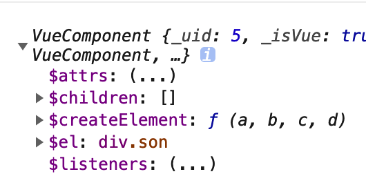
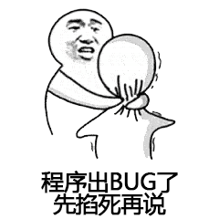

# vue组件参数定义

vue组件是项目开发中必不可少的一环。然而在开发时候，经常会遇到父组件需要监听子组件事件。假如我们要监听子组件中一个input值的变化，我们可以用代码来模拟一下。

父组件：

```html
<template>
    <son @handle-change="handleChange"></son>
</template>

<script>
import son from './son'

export default {
    methods: {
        handleChange() {
            // your code here
        }
    }
}
</script>
```

子组件：

```html
<template>
    <input @change="onChange"/>
    <!-- your code here -->
</template>

<script>
import son from './son'

export default {
    methods: {
        onChange(e) {
            // your code here
            let val = e.target.val
            this.$emit('handle-change', val)
        }
    }
}
</script>
```

通过这样的操作我们就可以监听子组件中input值的变化。

那有没有不用$emit触发事件的方法来实现的呢？

额，有的！我们只需要把父组件的监听方法作为参数传进来（以下代码只写不同的部分）。

子组件：

```javascript
import son from './son'

export default {
    porps: {
        handleChange: {
            type: Function,
            default() {
                return () => {}
            }
        }
    },
    methods: {
        onChange(e) {
            // your code here
            let val = e.target.val
            this.handleChange && this.handleChange(val)
        }
    }
}
```

父组件只需要变一下传参方式：

```html
<template>
    <son :handle-change="handleChange"></son>
</template>
```

目前我们有了实现父组件监听子组件的两种实现方式：

1. 参数法：单纯的父组件方法而已，处理起来比较灵活。

2. 事件法：vue自己的事件机制，服从其事件流程，常用的选择。

这两种方法有什么不同呢，孰优孰劣？别着急，我们先看看这两种方法在更加复杂环境下的表现。

## 事件拓展

现在有这么一个情况：一个文件上传，我们在提交上传前，需要做一下文件校验，比如限制文件格式，文件数目，文件大小等。假如校验不成功，则不会执行上传操作，而是提示用户错误信息。我们可以用参数法实现一下。

子组件：

```html
<template>
    <input type="file" @change="onChange"/>
    <input type="button" @click="onSubmit"/>
</template>

<script>
import son from './son'

export default {
    data() {
        file: null
    },
    porps: {
        handleChange: {
            type: Function,
            default() {
                return () => {}
            }
        },
        handleSubmit: {
            type: Function,
            default() {
                return () => {}
            }
        },
        handleBeforeSubmit: {
            type: Function,
            default() {
                return () => {}
            }
        }
    },
    methods: {
        onChange(e) {
            // your code here
            this.file = e.target.val
            this.handleChange && this.handleChange(this.file)
        },
        onSubmit() {
            let result = this.handleBeforeSubmit && this.handleBeforeSubmit(this.file)
            // console.log(result)
            if (result) {
                this.handleSubmit && this.handleSubmit(this.file)
            } else {
                console.log('上传文件不符合要求')
            }
        }
    }
}
</script>
```

父组件：

```html
<template>
    <son
        :handle-change="onChange"
        :handle-submit="onSubmit"
        :handle-before-submit="onBeforeSubmit"
    ></son>
</template>

<script>
import son from './son'

export default {
    methods: {
        onChange() {
            // your code here
        },
        onBeforeSubmit(file) {
            // 判断文件格式
            if (file.name.indexOf('image') < 0) {
                return false
            }
            // 判断大小
            if (file.size > 5000) {
                return false
            }

            return true
        },
        onSubmit() {
            // your code here
        }
    }
}
</script>
```

我们在子组件的 handleBeforeSubmit 方法执行时可以拿到父组件返回的值，因为 handleBeforeSubmit 就是父组件的 onBeforeSubmit 方法。从而决定是否提交文件。或者我们把返回的校验结果改为文案，直接在页面显示，也是可以的。

那我们用事件法做同样的操作会有什么结果呢？（魔改的代码就不写了，直接写结果）



这TND是个啥？


等等！貌似看到了$el，显示div.son。这不就是当前vue组件实例么？

原来vue事件把当前组件的实例也就是 this 返回回来。

## 异同

我们看到 vue 的 $emit 方法也有返回值，但是这个返回值是 this，也是为了方便用户链式调用吧。

那我们父组件的方法返回值呢？

抱歉，父组件的方法返回值在 $emit 内部，未被进一步返回回来。

那有其他方法可以拿到父组件方法的返回值么？

还真有！我们可以在 $emit 时，传入一个回调方法。

```javascript
// 子组件
this.$emit('handle-before-submit', (result) => {
    console.log(result)
});

// 父组件
onBeforeSubmit(callback){
    callback('haha');
}
```

那这TND跟参数法有毛线的区别？额，反正满足需求了，规不规范我不管。

所以要达成一个目标总是有方法的，条条大路通罗马嘛！我们也很清晰地看到了两种方法的优缺点。

1. 参数法：可以获得父组件方法的返回值，进行更深层次的逻辑处理，功能更强大。代码太繁琐。总要为程序不确定的类型添加兼容性代码，导致代码冗余。规定Function类型，鬼知道会不会哪位小哥脑袋抽风传了个null.

2. 事件法：常见用法，比较规范，代码更简洁。但是无法直接获取父组件方法的返回值，必须用回调方法实现。

## 结语

实际上，在项目中我们要遵守的很重要的规则是数据的单向流动，在vue中体现为：

props: 父组件 -> 子组件

$emit: 子组件 -> 父组件

但这也只是框架的思想，莎士比亚说过，“一千个程序员有一千万种bug”



错了！

“一千个读者有一千个哈姆雷特”，我们鼓励不同的思路去实现同一种功能，这样才能不断的学习提高。