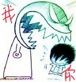
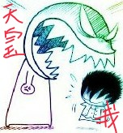
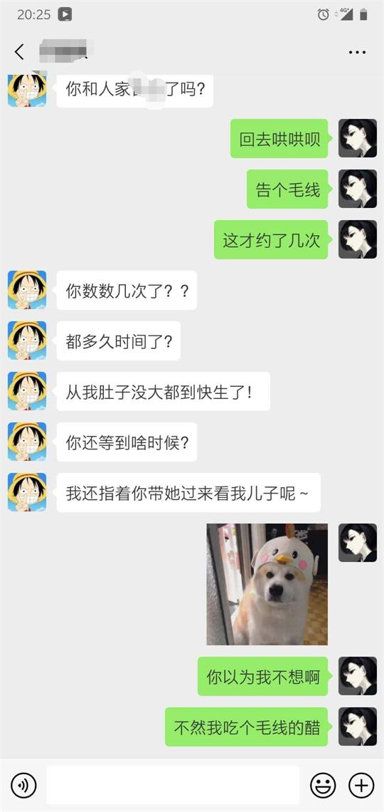
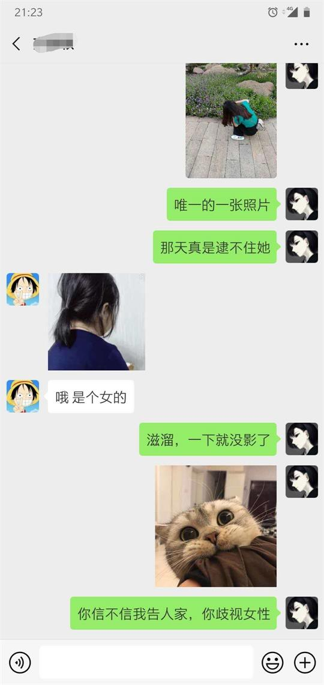
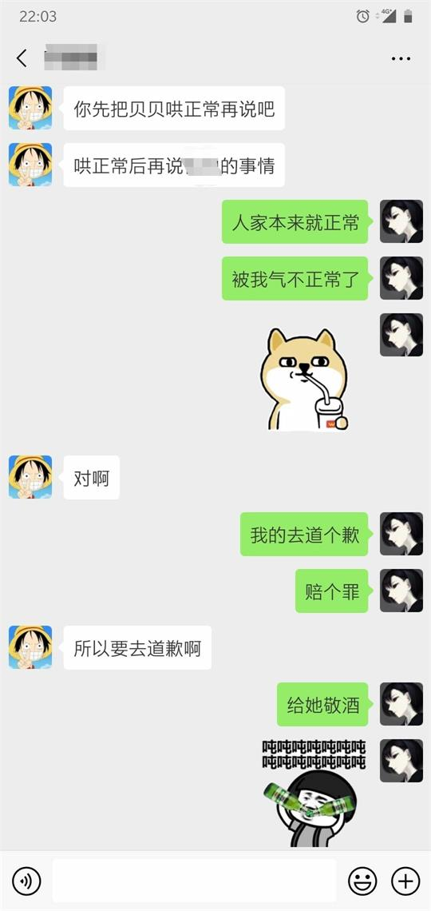
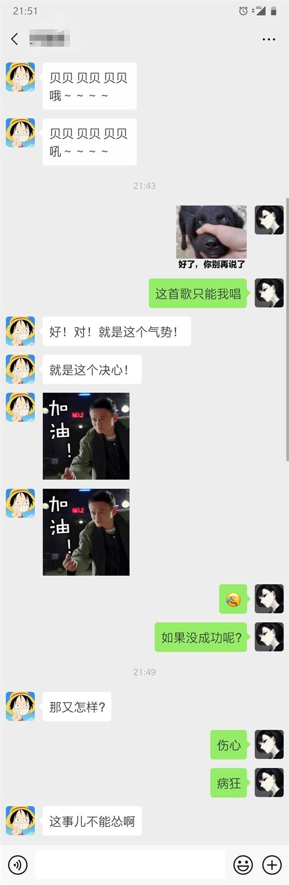
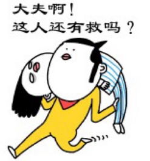

# 致歉信

（其实这篇才是我的正常画风）

亲爱的蓓蓓：

~~他们让我把修饰词放名字后面，我有点儿怂，没敢这么做。~~ 主要还是怕你还在 ~~害怕~~ ~~恐惧~~ 生气，没敢跟你打电话，你不会怪我食言吧。你总能找到最合适的方式来解决问题，这就是你的优点。

周末晚上的时候对你发火了！

~~我感到抱歉~~ ~~是我不好~~ 这是我犯的一个很严重的错误！

也是一时冲动，做出了傻事！事后懊悔不已，于翌日与天皇寻求解决方法。

结果……

~~有个错别字哎~~

经历了一个小时的个人审判，我 ~~豁然开朗~~ ~~认清了自己~~ 深刻地认识到了自己错误和不足！

总之审判后我意识到我的形象是：

蓬头垢面，

面黄肌瘦，

瘦骨如柴，

豺狼虎豹，

暴躁如雷，

雷声大雨点小，

小肚鸡肠，

肠肥脑满，

满腔怒火，

火烧眉毛，

毛发尽竖，

竖子成名，

名存实亡，

亡羊补牢，

牢不可破，

破铜烂铁，

铁石心肠，

肠肥脑满

……

打住打住，接龙咋又接回来了呢？

~~反正他们都说我几百遍了，死猪不怕开水烫~~

哎，感觉男生无论如何都不知道女生的想法的，不是诋毁我，就是吓唬我，你们这帮坏淫。

如果说男生不了解女生，倒不如直接问问女生。

正好，第一夫人休假在家，顺便去问候一下大侄子。

刚开口，第一夫人就直接步入正题了。

（见笑见笑，平时交流没那么细腻）

还是第一夫人体贴人！记得我的事情……太感动了！

哎，不对！这都几个月没见了，她是如何得知我的消息，而且还这么精确，明明才刚发生的事情……

不过既然都知道了，就顺便介绍一下吧。

刚想发个照片，突然意识到

**我——没——有——**

翻遍整个手机，才找到一张背影！

第一夫人的梦想可能要破灭了，我搞砸了。不仅没追上你，还让你跑了！

对于这种情况，第一夫人给出的答案是：女生心思缜密，容易多想，你应该拿出男人的大~~肚~~度。

哄一哄吧，或许还有救！

以及为我唱响的战歌（以前都没听她唱过）：

所以我就~~斗胆~~ ~~冒死~~ 腆着老脸来了。

所以，我想问问廖医生：

后续的事情，我现在还不敢去多想。你是我见过最单纯的女孩儿，只是希望这件事情不要对你造成太大的伤害。你我都是没有谈过恋爱的新手 ~~不对哦，你有过男票~~，做事欠考虑。我也在努力提高自己的共情力。

大家都在期盼着你的回归，无论结局如何，都是我的失误！

此致
敬礼