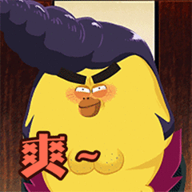

# 三打“嘤嘤怪”

话说人们自从食了善恶果，有了无穷无尽的智慧，便跳出三界之外，不在五行之中。他们造出了一种结界，将自己封印在里面。这种作茧自缚的行为，还派生出了“宅文化”。有歌为证：

界外三伏桑拿房，界内风吹透心凉。总之就是一个字——

熬过夏天都秘诀，除了夏眠外就是宅着了。

## 遭遇“嘤嘤怪”

这天，母上大人正在卧榻之上与众道友追忆往事。左手一只机，右手一直刷，好不惬意。忽然警觉道：你听到了么？

我：啥啊？

母上大人： ”嗡嗡嗡“的声音！

我：冇！

母上大人又警觉了一会儿，貌似也没有新发现，便又去会道友了。

没多久，总感觉有人在背后戳我脊梁骨。回头一看，母上大人做了个噤声的动作，指了指我的脚边。只见黑不溜秋一蒲扇，捡起一看，原来是一灭世法宝。

好个法宝：非金非银非铁铜，一柄一面一身孔；风声一缕定乾坤，打在身上特别疼。

## 智斗”嘤嘤怪“

持了法宝的母上大人，放下手机，慢慢地转过身去。悄悄将法宝伸了过去，一招风驰电掣，“嘭”的一声震耳欲聋……

却听得母上大人一声叹息，这次斗法应该是失败了。

又过了半晌，都没动静，应该是那妖孽不知所踪了吧。

……

待我放下戒心，马上入定之时，又听得一声雷响。手里的笔惊掉在地上。

一回头，见到母上大人已经锁定了那只“嘤嘤怪”。任他上下翻飞，左右穿梭……以不变应万变。法宝灵巧地捏在手中，等待最终一击。

她们斗了这么久，我才第一次看清楚了那妖怪的模样。

好个妖怪：眼睛瞪得像铜铃，~~射出闪电般的精明~~ 穿云破雾任我行；嘤嘤一起举世惊，扰动四方无安宁。

也许是飞累了，那妖孽在墙上落了下来，说时迟那时快，又是平地一声雷……

再看那妖孽，已经一命归西了。母上大人还不忘补上一脚，口中恨恨道：我教你给我嗡嗡嗡……

看到这触目惊心的一幕，我只能叹道：阿弥陀佛，善哉善哉！
