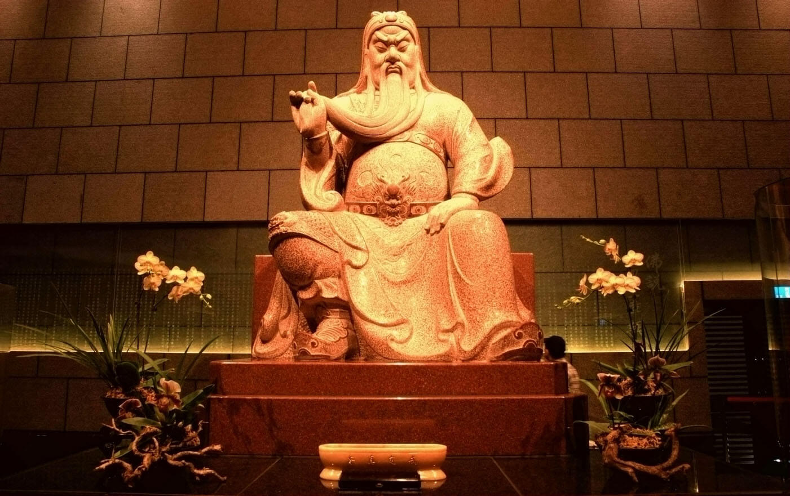

# 科学是什么（一）：神话起源

故事还得从一只蝙蝠讲起……

蝙蝠？为什么是一只蝙蝠？

因为一个人吃了一只蝙蝠，所以他变成了蝙蝠侠！

错了！他感染了新冠肺炎，然后他传染给了下一个人，然后下下个人，然后下下下个人……然后疫情爆发了，然后武汉封城了，然后村里也封村了。

每天的活动就是起床，躺下！起床，躺下！起床，躺下……

一周之后，终于忍受不了这种“有钱人的枯燥生活”，决定溜出门去看看外面的~~师姐~~世界。却发现自己不幸被锁在了门外。老妈说想要进门就要回答三个人类终极的问题：

1. 什么是科学？
2. 科学依据的标准又是什么？
3. 我们总在抵制迷信，难道神话都是假的么？

现在让我们坐在门前的石头上，一起思考这个问题。说实在的，这三个问题，这么长时间还真没有深入思考过。前两个先不说，话题太大，一两句说不清楚。我们在这里先研究研究第三个问题：**神话故事是真的么？**

纵观整个神话体系，我们发现神灵大致可以分为两种：

1. 虚构的神灵。
2. 神化的人物。

对于第一种类型的神灵，我们不做讨论！为什么呢？因为，知道是假的还讨论个屁啊！！！

对于第二种神话，真实性不太容易把握，也是今天我们所要探讨的重点。

## 神话起源

这里我们先了解一下历史学家对人类历史的划分：

|名称|阶段|
|--|--|
|史前史|历史记载（信史）前的时代|
|远古史|神话传说阶段（中国史学）|
|文明史|有历史记载（信史）的时代|

我们看到，在中国史学家眼里，神话传说也被独立出了一个时间阶段。所以我们的历史教材中，第一讲才会是远古神话。在历史课本中提到的远古神话很有限，其中有“女娲补天”、尧舜禹。这也是我们今天讨论的重点。

“[女娲补天](https://baike.baidu.com/item/%E5%A5%B3%E5%A8%B2%E8%A1%A5%E5%A4%A9/230)”的故事有很多版本，我们以《列子·汤问》中的版本为例：

> 天地亦物也。物有不足，故昔者女娲氏炼五色石以补其阙；断鳌之足以立四极。其后共工氏与颛顼争为帝，怒而触不周之山，折天柱，绝地维，故天倾西北，日月辰星就焉；地不满东南，故百川水潦归焉。

故事就是说：共工与颛顼（zhuān xū）两大部族大战，共工部战败，愤而水淹七军，导致了巨大的水患。这时我们的女首领——女娲，~~衔石而填海~~挺身而出，修建石坝，挡住了大水。

这里我们注意到两个关键词：**“女首领”、“水患”**。通过这两个关键词，我们或许能够得到一些信息。

一、女首领

在整个人类历史上，以女性为主导的时期大家首先想到的就是母系氏族社会。然而在整个石器时代，氏族基本都是以女性为主导的。整个石器时代又被分为新石器时代、中石器时代、新石器时代，故事到底发生在哪个时代呢？首先，有故事的出现，起码说明人类已经有了语言和文化。人类文明和文化的出现是在新石器时代（以下称母系氏族社会）：

> 新石器时代在考古学上是石器时代的最后一个阶段。以磨制石器为主，大约从公元前一万年开始，结束时间从距今7000多年至2000多年不等。 
这个时期，人类开始从事简单的农业和畜牧，将植物的果实加以播种，并把野生动物驯服以供食用。人类不再只依赖大自然提供食物，因此食物的来源变得稳定。同时农业与畜牧的经营也使人类由逐水草而居变为定居下来，节省下更多的时间和精力。在这样的基础上，人类生活得到了更进一步的改善，开始关注文化事业的发展，使人类开始出现文明。

得到第一个时间信息——**新石器时代：距今一万年前**。

二、水患

早期的人类文明沿河而生，就是因为河流的规律性泛滥会带来丰富的水土资源，有利于早期农业发展。有利就有弊，河流的泛滥自然会带来洪水，这应该是司空见惯的事情。因此单凭水患，我们似乎无法得出有用信息。

我们注意到这次水患应该是特大洪水，因为故事中的“折天柱”，就是说：天塌了。无独有偶，《圣经》中记载的“诺亚方舟”，源自《吉尔伽美什》的《阿特拉哈西斯》（Atra-Hasis）传说，都是大洪水事件。难道是巧合？

纵观人类早期神话故事，对大洪水对记载有600多次。这也说明这场大洪水是世界范围性的。既然是世界范围的事件，那么基本会在地质中留下痕迹。之前我们了解到新石器时代开始的时间大概在一万年前，在这段时间里，地球发生了什么样的变化呢？

在地质年代表中，我们注意到了[第四纪大冰期](https://zh.wikipedia.org/wiki/%E5%A4%A7%E5%86%B0%E6%9C%9F#%E7%AC%AC%E5%9B%9B%E7%BA%AA%E5%A4%A7%E5%86%B0%E6%9C%9F)的资料：

> 第四纪大冰期（Quaternary glaciation），或称作更新世大冰期（Pleistocene glaciation），当前大冰期（current ice age），或直接叫做大冰期（the ice age），开始于258万年前的上新世晚期（另一说为2000万年前南极大陆出现永久冰盖之时开始），延续至今。此次大冰期中，地球处于冰期与间冰期交替出现的旋回。目前，地球上的大陆冰盖仅存在于南极洲、格陵兰、巴芬岛等处。 距离现代较近的第四纪冰川时期的间冰期约为4万年，以后缩短为1万年。上一次冰期是约1万年前。

下图是科学家根据南极冰芯测量出的65万年来地球二氧化碳浓度数据，横轴为时间，刻度为5万年。我们看到最后一次二氧化碳浓度的提高是在大约1万年前
，二氧化碳为温室气体，二氧化碳浓度的提升意味着地球温度的回升。

得到第二个时间信息——**大冰期结束：约1万年前**。

大冰期所处的时间很巧，其结束时间刚好在一万年前，这与母系氏族社会开始的时间是一致的。

至此，整个事件的轮廓逐渐明晰了起来：一万年前，大冰期末期，地球进入间冰期，全球气温开始回升，导致大量冰川消融，这带来了全世界范围的大洪水。此时的人类处于母系氏族社会，女性具有氏族的领导权，拯救族群的重任就落在了女性肩上。

这便是我们熟知的“女娲补天”的历史背景。既然我们确定了故事发生的时间背景，这个故事八成是真的了。至于女首领是否真的叫女娲，有考究癖的同学可以继续深入探讨。

## 尧舜禹

其实历史上提到的神话人物不止女娲，还有我们耳熟能详的尧舜禹。如果按照时间排序，应该在女娲之后了。纵观整个人类历史，一万年的时间跨度，个人的真实性几乎无法验证，更何况当时的人类尚处于氏族时代，文字尚未成型。比起证实其人物，人物所处的历史背景似乎更有价值。

然而我们在史书中看到尧舜禹的记载，多半是歌颂其禅让制，举贤任能。对于禅让制，其真实性又如何呢？

我们现看一下尧舜禹所处的时代。在尧舜禹之后，就是我们历史上所学的第一个王朝——夏朝了。根据马克思主义史学观，在母系氏族与奴隶制社会之间的社会类型，就是父系公社（铜石并用时代）了。

父系公社时期的社会制度为军事民主制。军事与民主这不是一对反义词么，凑到一起如何理解？说白了，打得过就提倡军事，打不过就提倡民主，很合理。从制度名称可以看出，当时的社会是充满冲突的。部落与部落之间的利益纷争此起彼伏，战争带来的利益都转化为部落财产。战俘作为最大的奴隶来源，为部落的生产发展产生了不可估量的影响，我们如今所熟知的早期的世界奇观，多半是奴隶创造的。这也为后来的奴隶制社会奠定了基础。

从过去五千年史料中可以看到，封建社会在改朝换代的过程中，总是伴随着起义和暴动。封建社会是人类社会发展的成熟阶段，社会制度和道德都趋于完善，在政权的更迭过程中，尚且逃脱不了流血牺牲的命运；而数千年前制度与道德缺失的远古时代，却是彬彬有礼的和平禅让。这样的结论就好像，一个连成年人都解不出来的难题，被一个婴儿解决了，恐怕不能令人信服。

因此，当我们还原当时的场景，对比了封建社会之后便发现，在那段崇尚武力的时期，即便是部落内部，和平禅让，可能性也几乎为零。

其实对和平禅让持怀疑态度的学者也不乏其人。比如《荀子·正论》：

> 夫曰尧舜禅让，是虚言也，是浅者之传，是陋者之说也。

《竹书纪年》：

> 昔尧德衰，为舜所囚。舜囚尧，复偃塞丹朱，使不与父相见也。

柏杨在《中国人史纲》中，也对此进行过调侃：

> 纪元前二二八五年，伊祁放勋放弃政权，姚重华正式摄政。二十七年后的纪元前二二五八年，伊祁放勋逝世，寿命一百一十九岁，姚重华顺理成章的坐上宝座。 这是儒家学派所津津乐道的第一次“禅让”，坚称伊祁放勋是自动自发，非常愉快地把帝位传给姚重华。

和平禅让之所以会出现，应该是后世儒学家为了宣扬儒学思想而杜撰的故事。毕竟历史是个任人打扮的小姑娘。

附：神话故事的时间表

|时间|时期|故事及人物|
|-------|----------|---|
|约一万年前|大冰河时代结束||
|约一万年前至前5500|母系氏族（新石器时代）|女娲补天|
|前5500前2070|父系公社（铜石并用时代）|尧舜禹|
|前2070年|夏朝||

## 神话的成因

讲到这里，或许有人会好奇：神话是如何诞生的呢？

一、虚构的神灵

对于第一种神话故事，其实来源于早期人类对自然现象的认知。在远古时代，人们并不知道分子原子电子。对于自然界风火雷电等现象的产生，并不了解其原因。

看到下雨了，他们无法知道下雨的成因，只能想象背后有雨神~~萧敬腾~~。

如果打雷了，就是有雷神。如果这个时候恰好有人因为在树下避雨，被雷电击中丧命了；人们会将其与他之前的所作所为联系在一起：一定是他做了坏事。这种思想甚至拓展到这个世界都是神灵创造的。这就形成了神创论。

可以说神创论就是早期的科学。

二、神化的人物

第二种神话故事的成因，是因为时间太过久远。大家会发现，这一类人物主要是在文字诞生以前，那个时期没有文字和纸张，想要记录事情、传递信息，只能是一个人告诉另一个人。

我们都知道这样一个游戏：十个人排成一队，第一个人告诉第二个人一句话，然后第二个人告诉第三个……一直传递到最后。当最后一个人复述这句话时，往往和起初的意思大相径庭，甚至颠倒黑白了。更何况早期的神话故事要在不同的世代之间流传了。在口口相传的过程中，信息的丢失和错误最终导致了故事被神化。

文字出现以后，保留知识的载体——书籍很快出现了。通过书籍去保留知识，要可靠得多。直到现在，我们还能看到数千年前的原本。自此人类才开始了信史时代。

信史时代也存在造神现象。比如：我们所熟悉的关羽，在他死后被后世奉为菩萨，进了庙宇，被万世敬仰。然而在我们的印象中，关羽还是只是历史上的名人而已，神话现象并不严重。

无论是虚构的神灵还是远古神话，其实都是当时人类对世界的认识。可以说是在没有文字的年代，用语言记录的历史。在远古人眼中，神话就是科学。然而我们生活在现代社会，一个科技繁荣，信息爆炸的时代。我们有了更好的方法去研究这个世界，神话的科学性已经丧失殆尽，甚至严重干扰了我们的科学认知。如今的神话故事，我们还是将其看作一件艺术品，欣赏它的美妙吧。

## 结束语

其实神话故事有很多，但是能够作为史料被写进历史的屈指可数。但就是屈指可数的这些神话故事，却帮我们从中了解到一些人类先祖发展的蛛丝马迹。由于时间漫长的关系，这些故事大部分都面目前非了，我们能做的只能是利用现代科学考古的发现去辨别真伪。

如今的我们看待神话故事，觉得这仅仅是一个故事而已。千万年的时光，经历百代人的口口相传。如今以讹传讹的故事里，早已磨灭了许多人类发展的痕迹。如今我们追本溯源，就像沿着脚印一步步回溯我们来时的路，直到在戈壁滩发现了最后一个风蚀殆尽的足迹。这或许不能说明什么，但至少，我们知道，我们是从何方而来，历尽了怎样的坎坷。

## To be continue

你问我为什么老妈会让我回答这种问题？

故事还得从半小时前我要出门说起……

参考资料：

词条：维基百科 
《中国人史纲》-柏杨
