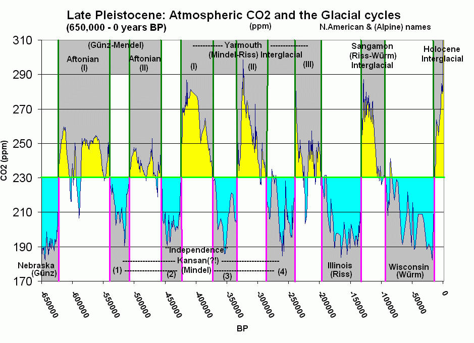

# 科学是什么（一）：神话起源

关在府里无事干，翻墙捣瓦摔瓶罐。 来来回回千百遍，小爷也是很疲倦。

这估计是这两个月来大部分人的真实写照了。能躺着为国做贡献，我感到十分的欣慰。然而现在，我觉得……再不放我出去，我就要拆家了。

在这段时间里，我们每天的活动就是起床，睡觉！起床，睡觉！起床，睡觉……

终于在一周之后，我忍受不了这种“有钱人的枯燥生活”，决定溜出门去非洲体验生活。回来却发现自己不幸被锁在了门外，而老妈说想要进门就要回答三个人类终极的问题：

1. 什么是科学？
2. 科学依据的标准又是什么？
3. 神话传说都是假的么？

现在让我们坐在门前的石头上，趁着夜色的凉意，一起思考这些问题。说实在的，这三个问题，这么长时间还真没有深入思考过。前两个先不说，话题太大，一两句说不清楚。在考试中遇到不会的题怎么办？当然是先跳过来！在这里我们先研究研究第三个问题：**神话传说都是假的么？**

纵观整个神话体系，我们发现神灵大致可以分为两种：

1. 虚构的神灵。
2. 神化的人物。

对于虚构的神灵，我们不做讨论！为什么呢？因为……知道是假的还讨论个屁啊！！！

对于神化的人物，真实性不太容易把握，也是今天我们所要探讨的重点。

## 历史里的神话

当我们翻开历史教材，发现在课本的第一讲几乎都提到了远古神话。其中就有“女娲补天”、尧舜禹。既然教材里都提到了，那我们来看一下故事的水分到底有多大。

我们先来看看大家都很熟悉的“女娲补天”：

“[女娲补天](https://baike.baidu.com/item/%E5%A5%B3%E5%A8%B2%E8%A1%A5%E5%A4%A9/230)”的故事有很多版本，我们以《列子·汤问》中的版本为例：

> 天地亦物也。物有不足，故昔者女娲氏炼五色石以补其阙；断鳌之足以立四极。其后共工氏与颛顼争为帝，怒而触不周之山，折天柱，绝地维，故天倾西北，日月辰星就焉；地不满东南，故百川水潦归焉。

故事就是说：共工与颛顼（zhuān xū）两大部族大战，共工部战败，撞折了用来支撑天的柱子，导致了人间巨大的水患。这时我们的女首领——女娲，~~衔石而填海~~挺身而出，炼五彩石，补住了天的漏洞，消除了大水。

刨除故事中虚构的成分，这时我们注意到整个故事只剩两个关键词：**“女首领”、“水患”**。还好有两个关键词，有线索总比没线索要好的多，我们或许能够得到一些信息。

一、女首领

在整个人类历史上，以女性为主导的时期大家首先想到的就是母系氏族社会。然而母系氏族贯穿整个整个石器时代，石器时代又被分为旧石器时代、中石器时代、新石器时代。故事到底发生在哪个时代呢？首先，有故事的出现，起码说明人类已经有了语言和文化。通过查看历史年代表，我们发现，人类文明和文化的出现是在新石器时代（以下称母系氏族社会）：

> 新石器时代在考古学上是石器时代的最后一个阶段。以磨制石器为主，大约从公元前一万年开始，结束时间从距今7000多年至2000多年不等。 
这个时期，人类开始从事简单的农业和畜牧，将植物的果实加以播种，并把野生动物驯服以供食用。人类不再只依赖大自然提供食物，因此食物的来源变得稳定。同时农业与畜牧的经营也使人类由逐水草而居变为定居下来，节省下更多的时间和精力。在这样的基础上，人类生活得到了更进一步的改善，开始关注文化事业的发展，使人类开始出现文明。

由于世界各地不同文明的发展程度和时间参差不齐，所以新石器时代结束的时间也不同。如果研究我们华夏文明的发展状况，我们就按照国内学者的说法，结束时间大致在公元前5500年。

得到第一个时间信息——**新石器时代：距今一万年前**。

二、水患

早期的人类文明沿河而生，就是因为河流的规律性泛滥会带来丰富的水土资源，有利于早期农业发展。有利就有弊，河流的泛滥自然会带来洪水。比如我们熟悉的黄河，据历史文献记载，黄河下游决口泛滥1500余次，较大的改道有20多次。因此单凭水患，我们似乎无法得出有用信息。

我们注意到世界各地的神话传说里，都有关于大洪水的故事。据统计，各大文明对大洪水的记载有600多次。比如《圣经》中的“诺亚方舟”；《吉尔伽美什》中的《阿特拉哈西斯》（Atra-Hasis）传说，都是大洪水事件。这也说明这场大洪水是世界范围性的。如果是世界范围的事件，那么基本会在地质中留下痕迹。之前我们了解到新石器时代开始的时间大概在一万年前，在这段时间里，地球发生了什么样的变化呢？

在地质年代表中，我们注意到了[第四纪大冰期](https://zh.wikipedia.org/wiki/%E5%A4%A7%E5%86%B0%E6%9C%9F#%E7%AC%AC%E5%9B%9B%E7%BA%AA%E5%A4%A7%E5%86%B0%E6%9C%9F)的资料：

> 第四纪大冰期（Quaternary glaciation），或称作更新世大冰期（Pleistocene glaciation），当前大冰期（current ice age），或直接叫做大冰期（the ice age），开始于258万年前的上新世晚期（另一说为2000万年前南极大陆出现永久冰盖之时开始），延续至今。此次大冰期中，地球处于冰期与间冰期交替出现的旋回。目前，地球上的大陆冰盖仅存在于南极洲、格陵兰、巴芬岛等处。 距离现代较近的第四纪冰川时期的间冰期约为4万年，以后缩短为1万年。上一次冰期是约1万年前。

下图是科学家根据南极冰芯测量出的65万年来地球二氧化碳浓度数据，横轴为时间，刻度为5万年。我们看到最后一次二氧化碳浓度的提高是在大约1万年前。二氧化碳为温室气体，二氧化碳浓度的提升意味着地球温度的回升。

得到第二个时间信息——**大冰期结束：约1万年前**。

大冰期结束的时间很巧，刚好在一万年前，这与新石器时代开始的时间大体是一致的。

至此，整个故事的轮廓逐渐明晰了起来：一万年前，大冰期末期，地球进入间冰期，全球气温开始回升，导致大量冰川消融，这带来了全世界范围的大洪水。此时的人类处于母系氏族社会，女性具有氏族的领导权，拯救族群的重任就落在了女性肩上。

这便是我们熟知的“女娲补天”的历史背景。既然我们确定了故事发生的时间，这个故事八成是真的了。

如果有人要问：你怎么知道她就叫女娲呀？拜托，给个面子好不？

## 尧舜禹

说完了女娲，来说说我们耳熟能详的尧舜禹。我们在史书中看到尧舜禹的记载，多半是歌颂其禅让制。对于禅让制，估计大家的第一印象是“举贤任能”的和平禅让，然而事实真的如此么？

按照时间排序，尧舜禹应该在女娲之后了。因为在尧舜禹之后，禹的儿子启建立了我们历史上所学的第一个王朝——夏朝了。夏朝是一个奴隶制社会，在母系氏族与奴隶制社会之间的社会类型，就是父系公社（铜石并用时代）了。

父系公社时期的社会制度为军事民主制。估计有人就好奇了：军事与民主这不是一对反义词么，凑到一起如何理解？说白了，部落内部是民主，大家共攘大事；部落以外是军事，大家同仇敌忾。

从制度名称可以看出，当时的社会是充满冲突的。部落与部落之间的利益纷争此起彼伏，战争带来的战利品都转化为部落财产。战俘作为最大的奴隶来源，为部落的生产发展产生了不可估量的影响，我们如今所熟知的早期的世界奇观，多半是奴隶创造的。这也为后来的奴隶制社会奠定了基础。

从过去五千年史料中可以看到，封建社会在改朝换代的过程中，总是伴随着起义和暴动。封建社会是人类社会发展的成熟阶段，社会制度和道德都趋于完善，在政权的更迭过程中，尚且逃脱不了流血牺牲的命运；而数千年前制度与道德缺失的远古时代，却是彬彬有礼的和平禅让，恐怕不能令人信服。

当我们还原当时的场景，对比了封建社会之后便发现，在那段崇尚武力的时期，即便是部落内部，和平禅让，可能性也几乎为零。

其实在史料中也有和“和平禅让”相悖的记载。比如《荀子·正论》：

> 夫曰尧舜禅让，是虚言也，是浅者之传，是陋者之说也。

《竹书纪年》：

> 昔尧德衰，为舜所囚。舜囚尧，复偃塞丹朱，使不与父相见也。

对和平禅让持怀疑态度的学者也不乏其人，比如柏杨在他的著作《中国人史纲》中，便对此进行过调侃：

> 纪元前二二八五年，伊祁放勋放弃政权，姚重华正式摄政。二十七年后的纪元前二二五八年，伊祁放勋逝世，寿命一百一十九岁，姚重华顺理成章的坐上宝座。 这是儒家学派所津津乐道的第一次“禅让”，坚称伊祁放勋是自动自发，非常愉快地把帝位传给姚重华。

和平禅让之所以会出现，应该是后世的儒学家为了宣扬儒学思想而杜撰的故事。毕竟那是一个百家争鸣的时代，越是在乱世，越要通过禅让来证明君主的贤明。与其说是禅让，倒不如说是政权的更迭，历史上的每次改朝换代其实都可以称为“禅让”。

## 神话的成因

其实到这里，我们已经知道了我们最初问题的答案了。神话故事不能完全说是真的，也不能完全说是假的。我们总用它们来说明问题，却又知道它们缺乏科学依据。这种真假共存的现象，就像“薛定谔的猫”。之所以会出现这种真假莫辨的局面，还是与神话形成的背景有关。

一、虚构的神灵

对于第一种神话故事，大家比较熟悉的就是雨师风婆、雷公电母、山神土地、二十八星宿等。这一类神灵都代表着一种自然现象，自然界的各种现象都是他们的“神迹”。这一切其实来源于早期人类对自然的认知。在远古时代，人们并不知道分子原子电子。对于自然界风火雷电的产生，只能想象现象的背后也是人为因素，只不过这一种人有特殊的能力。

下雨了，有雨神~~萧敬腾~~。

打雷了，就是有雷神；刮风了，有风神。如果这个时候恰好有人因为在树下避雨，被雷电击中丧命了；人们会将其与他生前的所作所为联系在一起：一定是他做了坏事。万物皆是人为因素，这种思想与世界的起源融合到一起的时候，就形成了神创论。

二、神化的人物

第二种神话故事虽然基于事实，然而因为时间太过久远，导致信息错误或丢失。我们从信息论的角度来看待这个问题，会简单很多。

上面提到的女娲和尧舜禹，主要是在文字诞生以前，那个时期没有文字和纸张，想要记录事情、传递信息，只能是一个人告诉另一个人。

语言传递信息的过程，可以用最基础的通信系统模型来表示。

信源就是信息的发出者，我们这里指讲故事的人；信宿是信息的接受者，我们这里指听故事的人；信道是指信息的传播途径。假如信息的正确率为100%，那么到达信宿，信息的正确率就完全取决于信道的好坏。古代没有电话，那么通过语言传递信息就是面对面交流了，干扰我们也完全忽略不计。也就是说信息是100%传递成功的。

那么问题就来了，导致信息错误的根源就只能出在信宿身上了。具体来讲就是每一个听故事的人，都是下一个讲故事的人。即便我们全部听到了故事，也不能100%还原。由于遗忘的原因，我们在信息传递的过程中，总要加一些主观因素的信息在里面，这就对故事原本的内容造成了更改。

我们应该都玩儿过传话游戏：十个人排成一队，第一个人告诉第二个人一句话，第二个人复述给第三个人，以此类推直到最后。当最后一个人复述这句话时，往往和起初的意思大相径庭。

既然信息传递有可能出错，那我们就在接受信息的时候进行校验不就可以了么？如果错误的信息能够得到校验并及时修正，那么故事也不会错的太离谱。

仅凭语言传递的信息是很难进行校验。首先，语言不会一直停留在空气中；其次，如果我们向同一个人反反复复确认同一个问题，你确定你不会被打？假如我们直接去寻找第一个讲故事的人，得到的答案多半是：死了！那假设讲故事的是龟仙人，千年不死，同一个故事，他能讲的一字不差么？

更何况早期的神话故事要在不同的世代之间流传了。在口口相传的过程中，信息的丢失和错误最终导致了故事被神化。

语言的这些特点都表明：语言只是信息的载体，而非知识传播的媒介。

文字出现以后，这一现象就得到了极大改观。我们传递信息的通信模型变成了这样：

文字是对信息的一次编码，认识文字是对信息的一次解码。文字出现以后，很快书籍就出现了。书籍作为知识的载体，起到了校验和修正的作用。我们不用去反复询问老师同一个问题，只用在书籍中就能找到答案，并且是统一的答案。

通过书籍去保留知识，要可靠得多。直到现在，我们还能看到数千年前的原本。自此人类才进入了信史时代。

这也是为什么西方学者在研究中国历史时，从商代开始。因为商代出现了甲骨文，是我国第一个有史可考的朝代。

其实信史时代也存在造神现象。比如：我们所熟悉的关羽，在他死后被后世奉为菩萨，进了庙宇，被万世敬仰。但这种现象只是人们为了铭记某些事物，表达自己的敬意。在我们的固有观念中，关羽依然只是历史上的名人而已。

## 结束语

从神话故事的成因我们可以看到，无论是虚构的神灵还是神化的人物，都体现了当时人类对世界的认识。是在那个没有文字的年代，用语言记录的历史。千万年的时光，经历百代人的口口相传。如今以讹传讹的故事里，早已磨灭了许多人类发展的痕迹。然而就是这所剩无几的信息，在悄悄诉说着人类祖先的生活。与其说是远古神话，倒不如说是远古科学。

我们生活的现代社会，是一个科技繁荣，信息爆炸的时代。我们有了更好的方法去研究这个世界，通过考古研究还原出的远古历史远比神话故事可靠的多。神话所蕴含的信息已经形如鸡肋，甚至严重干扰了我们的科学认知。如今的神话故事，还是将其看作一件艺术品，欣赏它的美妙吧。

现在的我们看待神话故事，觉得这仅仅是一个故事而已。如今我们追本溯源，就像沿着脚印一步步回溯我们来时的路，直到在戈壁滩发现了最后一个风蚀殆尽的足迹。这或许不能说明什么，但至少，我们知道，我们是从何方而来，历尽了怎样的坎坷。

## To be continue

你问我为什么老妈会让我回答这种问题？

故事还得从半小时前我要出门说起……

参考资料：

词条：维基百科 
《中国人史纲》-柏杨
