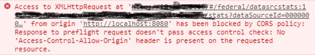

# 闲侃跨域

前端在处理请求的时候，有时候会遇到这样的问题：

翻译过来就是：当前请求违反了同源策略，导致了跨域。这就是我们常说的跨域请求。

# 跨域请求是什么

说到跨域请求，就得先说[CORS](https://developer.mozilla.org/zh-CN/docs/Web/HTTP/Access_control_CORS).

> 跨源资源共享 (CORS) （或通俗地译为跨域资源共享）是一种机制，该机制使用附加的 HTTP 头来告诉浏览器，准许运行在一个源上的Web应用访问位于另一不同源选定的资源。 当一个Web应用发起一个与自身所在源（域，协议和端口）不同的HTTP请求时，它发起的即跨源HTTP请求。

看了定义没看懂，没关系。说白了，只有请求的资源与发请求的页面处于同一个源下，这个请求才不跨域。

怎么定义同一个源呢？域名，协议，端口全部相同，才是同一个源。

# 现实中的跨域

其实所有请求都是电脑之间的通信。我们把服务器类比成一个国家。那么浏览器其实只是国家里面的一个公司或者个人。

假如我们是H公司，是做全球生意的。现在呢，公司要做大飞机。但是要做大飞机不得需要各种零部件么？大部分零部件国内有，唯独缺少一个好的发动机。想要发动机得去A公司进口。

于是H公司跟A公司说：我们想要你们的发动机。

A公司收到了通知，一看有人要买自己的发动机，心中大喜，回复：好的。

但是有个问题，H公司在C国，A公司在A国。这可是一桩跨国生意。跨国生意不好做，万一路上有流氓、海盗逼着你开一千万的发票，这里面的风险很高的。所以一般都是国内公司相互做生意。

但是现在可是特殊时期，大洋彼岸的A国人民需要我们的支援。这桩生意，势在必行。但是做生意需要三要素：

时间、地点、人物！！！

错了！这桩生意三大要素：A国(域)、A公司(端口)，还有……他们说川普(协议)！

不去A国找不到A公司，不到A公司买不到发动机，不说川普无法交流。

万事俱备只欠东风！！！东风来了，吹着我们的小帆船出发了。顺利的话，一年半载，我们就带着发动机从西方取经归来了。
