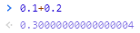

# 通货膨胀的成因

> 通货膨胀是在一定时间内一般物价水平的持续上涨现象。

工作中经常会遇到处理一些价钱的操作。价钱当然也是小数，只不过比较特殊，最多是小数点后两位。小数在称序中被称为浮点数，但是浮点数的操作涉及到一个问题：

0.1+0.2≠0.3（这是一个很有意思的问题，有兴趣的同学可以自行百度一下）

因此遇到价钱的运算，我们不能简单的直接加减。如何处理呢？浮点数的运算存在精度损失，但是整数运算不存在啊；并且价钱最多到小数点后两位。那就好办了：我们将价钱先乘以100，取整运算，最后输出时再除以100.这样就避开了浮点数运算的精度损失。

## 定价问题

老王开了一个饭馆。定价一个馒头1毛，一个包子2毛。如果饭馆只有馒头，包子，这样没问题。这时，老王做出了一种新的食物——饺子。那饺子该如何定价呢？

老王想：饺子比馒头好吃，应该比馒头贵；但是比包子小，应该比包子便宜。那一个饺子应该卖1.5毛。

嗯？现在出现了小数。如果我们最小的货币单位是毛，那就无法支付半毛钱。但是饺子确实好吃，饭馆又要卖。这种情况下该怎么办呢？

老王一想：我把价钱涨一倍不就行了？馒头变成了2毛，包子变成了4毛。那饺子就是3毛了。这样就不会出现半毛钱的情况了。

自然状态下，通胀的机制出现了：我们的货币单位只有元角分，是有限的，**当最小的货币单位也无法衡量一个物品的价值时，就会出现自然的通胀**。

当然自然的通胀还是有前提条件的。

## 新生事物

上面发生通胀的原因其实很简单，老王做出了饺子。饺子是之前饭馆里没有的食物，因此也就没有价钱。

新生事物繁多其实是社会发展繁荣的表现，因此在社会快速发展的阶段，通胀会自然发生。
